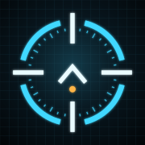

# VISR

VISR is an unofficial native port of the Halo: Combat Evolved decompilation to
Apple platforms: iPhone, iPad, Apple Vision Pro, Apple TV and the Mac. It runs
the original Xbox game's code compiled for ARM64, with an OpenGL ES or Metal
renderer, SDL audio, touch controls and game controller support.

VISR ships no game data. You bring your own copy of the original Xbox disc, and
the app imports its maps on your device.

VISR is a fan project. It is not affiliated with or endorsed by Microsoft,
Halo Studios (formerly 343 Industries) or Bungie. See [Legal](#legal).

## Bring your own disc

The app contains the decompiled game code and nothing else of the game: no
maps, sounds, textures, videos or fonts from the disc. To play, you need a disc
image (`.iso` or `.xiso`) of the original Xbox release of Halo: Combat Evolved,
made from a disc you own:

- NTSC-US, map build `01.10.12.2276`
- PAL, map build `01.01.14.2342`

The importer checks the image's file system, the map build numbers and that the
full campaign is there before it copies anything. PC, Custom Edition and Master
Chief Collection files are not supported.

## Features

- **Native code, no emulator.** The game's code is compiled for ARM64 with
  32-bit pointers and runs inside a 4 GB block of memory, straight out of the
  signed app. It does not use JIT or writable executable memory.
- **On-device import.** Pick your disc image in Files, or drop it into the
  app's folder, and VISR extracts the maps with a progress bar. Interrupted or
  invalid imports never replace maps you already have.
- **Native resolution.** The game renders at the display's full resolution,
  with the HUD and controls at their original size. You can lower the render
  resolution or switch to the original 4:3 framing in `config.toml`.
- **Two renderers.** OpenGL ES 3 is the default on iPhone and iPad. The Metal
  renderer adds MetalFX upscaling, compressed textures, anisotropic filtering,
  larger shadow maps and full-resolution active camouflage.
- **Touch and controllers.** On-screen sticks and buttons, which you can hide,
  and any controller the system supports.
- **Apple Vision Pro.** The game plays in a window with a game controller, with
  Metal at the window's resolution. On visionOS 26 and later, theater mode puts
  the picture on a screen in an immersive space.
- **Mac.** The same app builds for Mac Catalyst on Apple silicon.
- **Multiplayer from upstream.** Split-screen co-op, LAN play and internet play
  through invite links and a server browser come from
  [OpenCE](https://github.com/OpenCommunityEdition/OpenCE). On iPhone and iPad,
  internet hosting and clipboard joining are off by default, and multiplayer
  has not been validated yet.

### Planned

These are in development on other branches and are not in `main` yet:

- Stereo rendering on Apple Vision Pro, so the game world has depth, with
  foveated rendering driven by the Vision Pro's rate maps
- Further renderer and texture quality work

## Status

VISR is early. The menus and the campaign run on iPhone and iPad, and the
[validation record](port/ios/VALIDATION.md) lists what has been tested on which
devices and the known issues. Apple TV, Apple Vision Pro and the Mac build are
less tested than iPhone and iPad. Bink intro videos do not play.

There are no prebuilt releases yet, so for now you build VISR from source and
sign it with your own Apple account.

## Device requirements

| Platform | Minimum | Notes |
| --- | --- | --- |
| iPhone and iPad | iOS and iPadOS 16 | Landscape only. Tested on iPhone 17 Pro Max and iPad Pro 13-inch (M5). |
| Apple Vision Pro | visionOS 2 | Metal only. Theater mode needs visionOS 26. A game controller is required. |
| Apple TV | tvOS 16 | Imports the disc image over the local network. |
| Mac | Apple silicon | Mac Catalyst build. |

Every platform needs enough free storage for the extracted maps, plus the disc
image while it imports.

## Building from source

You need an Apple silicon Mac with Xcode, Python 3 and Homebrew. The validated
toolchain is Xcode 27 with Homebrew LLVM and LLD 23.1.2.

```sh
git clone https://github.com/steverice/visr.git
cd visr
brew install cmake ninja llvm lld sdl3 pkgconf

# Run the regression tests
python3 tools/ios_test.py

# Build and sign for your own iPhone or iPad
# (add your Apple account in Xcode > Settings > Accounts first)
python3 tools/ios_build.py --team YOUR_TEAM_ID --bundle-id com.yourname.visr

# Build an unsigned IPA to sign later
python3 tools/ios_build.py --unsigned --ipa dist/VISR-iOS-unsigned.ipa

# Build for the simulator
python3 tools/ios_build.py --simulator

# Other platforms
python3 tools/ios_build.py --visionos --team YOUR_TEAM_ID --bundle-id com.yourname.visr.vision
python3 tools/ios_build.py --tvos --team YOUR_TEAM_ID --bundle-id com.yourname.visr.tv
python3 tools/ios_build.py --mac
```

The build script downloads SDL, musl and the Khronos headers itself. The
[build and install guide](port/ios/README.md) covers installing to a device
from the command line, the simulator, Apple Vision Pro, display settings and
troubleshooting.

To sign an unsigned IPA without Xcode,
[AltStore](https://faq.altstore.io/) and [Sideloadly](https://sideloadly.io/faq)
have guides. Keep the same bundle ID when you update, and your saves carry over.

## Playing

1. Open **VISR** and tap **Choose XISO**, then pick your disc image in
   Files. You can also copy the image into the VISR folder in Files (or in
   Finder's Files tab for your device) and open the app.
2. Wait for the import to finish. The game starts by itself, and from then on
   the app opens straight into the game.
3. Once the import is done, you can delete the disc image from the VISR
   folder to free up space.

Saves live in the `save` folder inside the VISR folder in Files. Back it up
before you delete the app.

### Controls

- **Left stick** to move, **right stick** to look
- **A** jump and select, **B** melee and back, **X** reload and use, **Y**
  switch weapons
- **Arrow buttons** for menus
- **FIRE**, **GRENADE**, **CROUCH**, **ZOOM**, **LIGHT** (flashlight),
  **SWAP G** (switch grenades) and **PAUSE** each have their own button

Tap **Hide controls** for a clear screen when you use a controller.

## How it works

The game's data structures use 32-bit pointers. The port compiles the game for
ARM64 with 32-bit pointers, rewrites its memory accesses to land inside an
aligned 4 GB block of memory, and embeds the result in the app's signed code.

- `source/` is the decompiled game, from the upstream decompilation projects
- `port/runtime` is the portable runtime
- `port/ios` is the Apple app: UIKit, touch controls, audio, the loader, the
  disc importer, the Metal renderer and the visionOS scenes
- `port/linux` holds the platform layer, the OpenGL renderer and the Xbox
  compatibility layer shared with the upstream desktop ports
- `tools/` has the build, packaging and test scripts

The upstream desktop builds for Linux and Windows still build from this tree;
see [README.upstream.md](README.upstream.md).

## Reporting bugs

[Open an issue](https://github.com/steverice/visr/issues) with your device, OS
version, the app's version and what you were doing when it went wrong.
`ios-runtime.log` and `debug.txt` in the VISR folder help a lot. Skim them for
anything personal before you attach them. Please do not attach game files or
disc images.

Security problems go through [SECURITY.md](SECURITY.md) instead.

## Contributing

See [CONTRIBUTING.md](CONTRIBUTING.md). Everyone who takes part agrees to the
[code of conduct](CODE_OF_CONDUCT.md).

## Credits

VISR is built on a lot of other people's work:

- [punpckhdq/halo](https://github.com/punpckhdq/halo), the original Halo: CE
  decompilation
- [bnunu/halo-1](https://github.com/bnunu/halo-1), bnunu's fork of the
  decompilation, with Jonas Volman and the other contributors in its history
- [OpenCE](https://github.com/OpenCommunityEdition/OpenCE) (formerly
  cybersecurity/halo-ce-universal), the native ports this one is based on:
  the ARM64 runtime, the renderer, audio, the high-resolution HUD and menus,
  and multiplayer
- [NicholasDominici/halo-ce-ios](https://github.com/NicholasDominici/halo-ce-ios),
  the iOS port this repository started from: the 32-bit pointer model on
  ARM64, the iOS host and the on-device importer
- [pfista/halo-og](https://github.com/pfista/halo-og), Michael Pfister's port
  with a native Metal renderer for macOS: exact texture border colors, pixel
  shader combiner fixes, and the pre-HUD spot for post-processing
- [xemu](https://xemu.app/), the Xbox emulator, whose model of the Xbox GPU's
  pixel shaders the shader translators follow

The XISO importer builds on [extract-xiso](https://github.com/XboxDev/extract-xiso).
This product includes software developed by in <in@fishtank.com>.

The fonts are Overpass and OpenCE (SIL Open Font License 1.1) and Newtown by
Roger White (public domain). The third-party libraries and their licenses are
listed in [NOTICE.md](NOTICE.md).

## License

The code is under CC0 1.0, the same as every upstream project (see
[LICENSE.md](LICENSE.md)). Third-party components keep their own licenses,
listed in [NOTICE.md](NOTICE.md). The CC0 dedication covers only what its
contributors could dedicate. It does not grant any rights to Microsoft's game,
its assets or its trademarks.

## Legal

Halo, Halo: Combat Evolved, Master Chief and the related names and logos are
trademarks of Microsoft Corporation. Halo: Combat Evolved © Microsoft
Corporation. VISR is an unofficial fan project. It is not affiliated with,
sponsored by or endorsed by Microsoft, Xbox Game Studios, Halo Studios
(formerly 343 Industries) or Bungie.

VISR does not include or distribute the game's maps, sounds, textures, videos
or other content, and it does not help you obtain them. You need your own copy
of the original Xbox game. VISR is free and is not sold.
